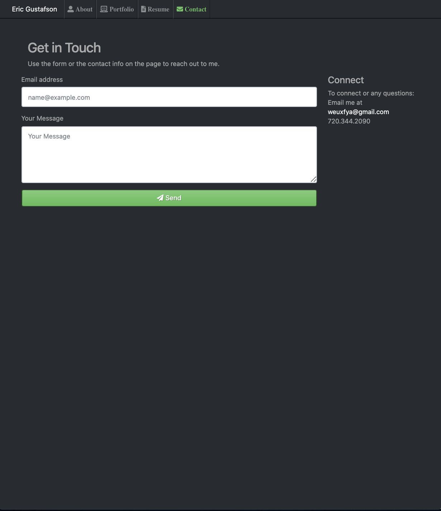

# portfolio

A professional portfolio page to highlight skills through representative projects.

# Description

Portfolio page to display your dev skills.

# Visuals

### About page

The About page features and overview. This includes a bio and overview of skill set.

### Portfolio page

The Portfolio page features projects. Each project is represented with a picture or gif.
Each project has a link to the Github repo and the project hosted on Github pages.

### Resume page

The Resume page contains an online version of the resume in the web site's theme.
The page also contains a link to a PDF version of the resume optimized for printing.

### Contact page

The Contact page offers a contact form and contact information.  
Contact can be made using the form or the contact information

# Usage

The web site is a Portfolio site used to highlight skills. The portfolio displays projects representing the skill set.

# Link to project on Github

[portfolio](https://eric-gustafson1.github.io/portfolio/)
